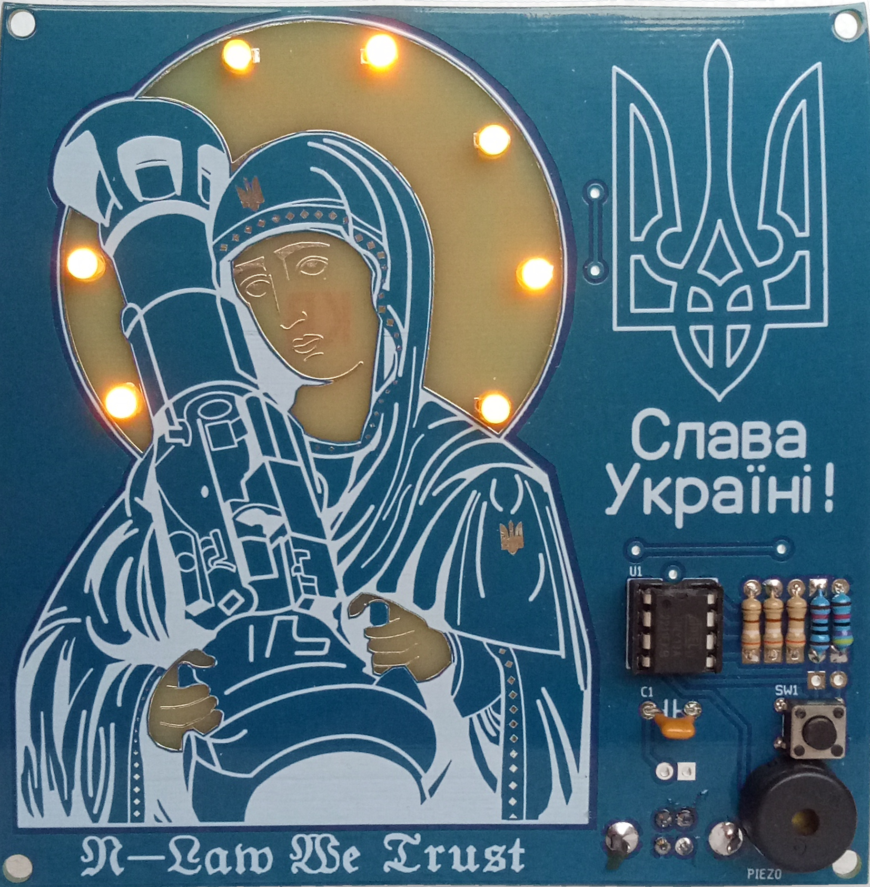
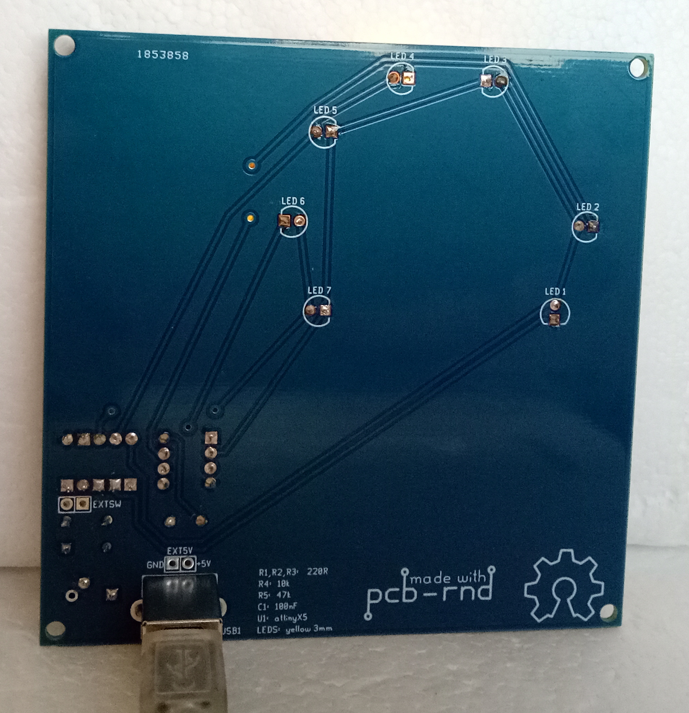
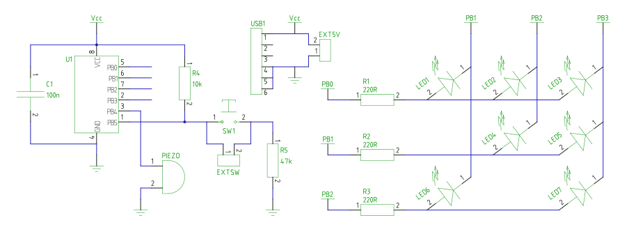

# STEM4ukraine-Saint-Javelin

A simple PCB with sound effects and the light show set off by pressing of the button!

An ideal school STEM project demonstrating use of GPIO for detecting button presses with software debouncing, charlieplexxing of multiple LEDs and playing music on the Piezo speaker.

Celebrate Saint Javelin while you play the Ukrainian national anthem on the built in speaker!

The front of the PCB

The rear of the prototype PCB

The schematic

Bill of materials:

U1:  attiny13
C1:  100nF
R1,R2,R3:  220R
R4:  10k
R5:  47k
LED1-7:   yellow 3mm LED
SW1: momentary switch
PIEZO:  piezo speaker
USB1:  180 degree vertical through hole type B USB socket
